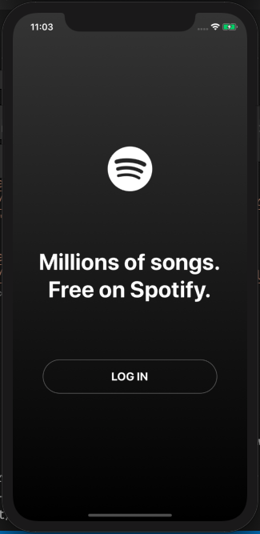

<h1 align="center">
 
Spotify
</h1>

An app for songs.

  
  

## Features

This app features all the latest tools and practices in web development!

- ⚛ **React** — A library to build user interfaces
- 💅 **CSS** — styled-components
- 💖 **Lint** — ESlint/Prettier/Editor Config

## Preview

## License

This project is licensed under the MIT License - see the [LICENSE.md](LICENSE.md) file for details.
